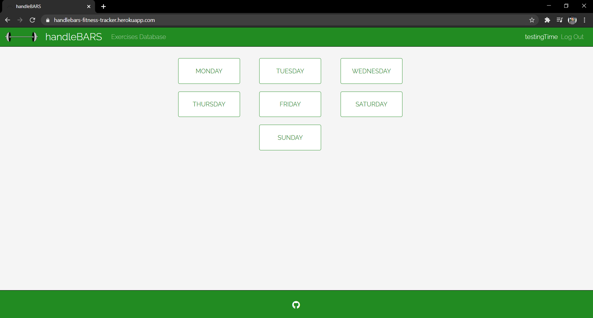
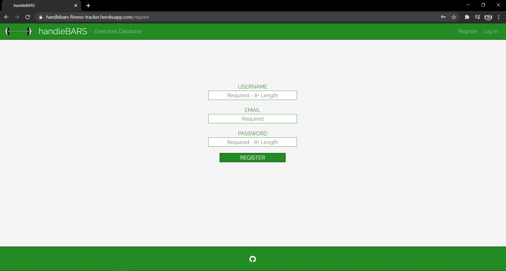
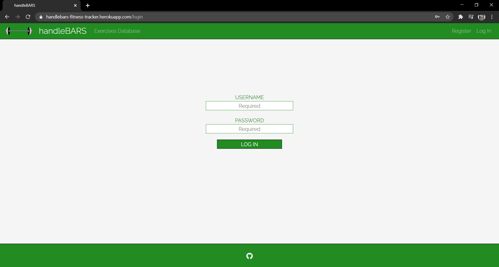
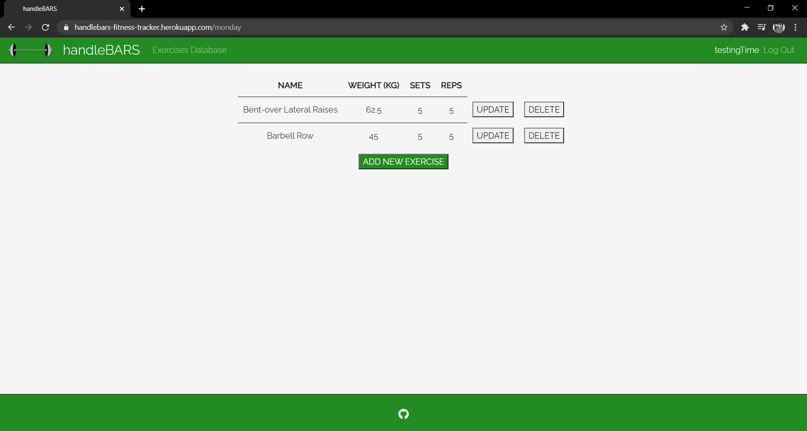
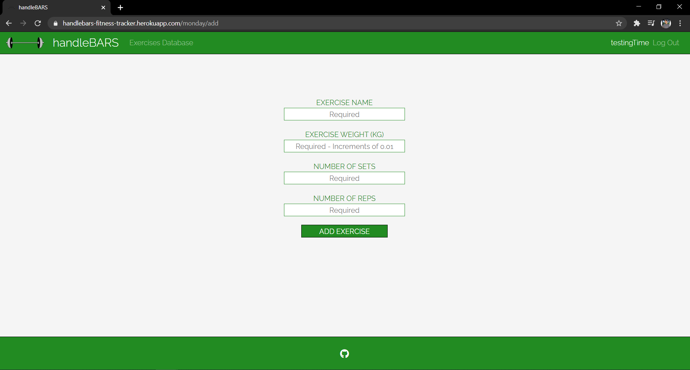
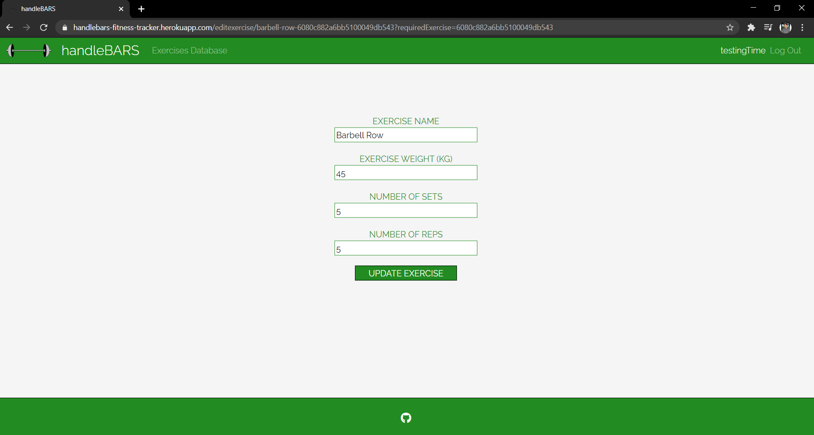
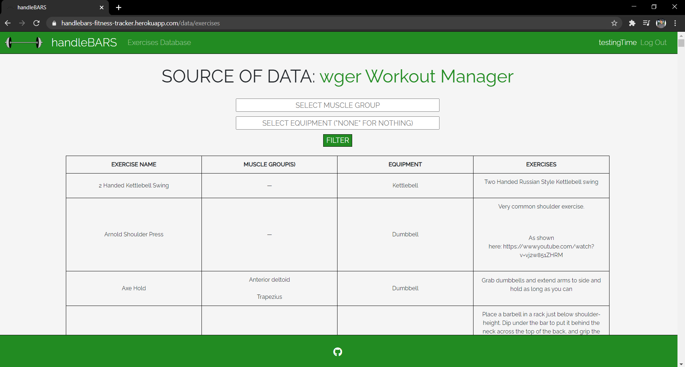

# handleBARS: Your Personalized Fitness Tracker

## Main File

Press [here](./app.js) to check the main file for the application.
 ## Overview 

Picture this: it is New Year's Day and you have once again made the resolution to go to the gym for the n-th time. You get there and realize there is so much to do and so little to keep you on track. What do people mean by incrementing volume? Are your weights improving or is it in your head? What exercise did you do last week and what were you supposed to do today? With so many questions going through your head, you may quickly lose the motivation to work out. After all, you came to get those gains or shred those unnecessary ones, not to crunch numbers in your head all the time.

handleBARS is now here to change the game. No longer will you have to contend with roughly sketching out workout plans on notebooks or resort to rigid workout applications that force you to follow certain routines. Rather, make a personalized account and add the workouts you are doing each day of the week and keep track of your routine. Keep track of your weights, sets and reps as you switch from one exercise to another, personalizing your plan for each day. And with each new week, see where you were before and update accordingly. Let go of the number-tracking as the app does it for you, and focus on just the the exercises you do and the equipment that you use.

With handleBARS, you will be able to handle your bar lifts and so much more.

## Data Model

This application will store users and their exercises, with separate lists for exercises of different days. For this purposes, we will be implementing the following three MongoDB schema:

1. User
2. Day
3. Exercise

Each user will have a workout plan for seven days, with each day indicating different exercises. These relations will be implemented via references. The relations are roughly as follows:

1. User's Reference to Days
2. Day's Reference to User
3. Day's Reference to Exercises
### <div align="center"> An Example "User" </div>

```javascript
{
    _id: ObjectId("dfadsf4f1"), // Unique identifier
    username: "ShehryarHanif", // User's personalized name
    email: "shehryar.hanif@nyu.edu", // User's email address
    exerciseDays: [...], // An array of references to "Day" documents (seven days of the week)
    salt: "de92b8", // A password salt
    hash: "fkljdsakl3j4kl65j34l53", // A password hash
    __v: 0 // Version of the schema
}
```

### <div align="center"> An Example "Day" </div>

```javascript
{
    _id: ObjectId("adfadfadsfadsf"), // Unique identifier
    name: "Monday", // Name of the day
    exercises: [...], // An array of references to "Exercise" documents (exercises done on that particular day)
    __v: 0, // Version of the schema
    user: ObjectId("dfdfadsfdsf"), // Reference to "User" document (user who is tracking exercises)
}
```

### <div align="center"> An Example "Exercise" </div>

```javascript
{
    _id: ObjectId("dfdfadsfasdfdsf"), // Unique identifier
    slug: "barbell-row-dfdfadsfasdfdsf", // Unique identifier for website
    name: "Barbell Row", // Name of the exercise
    weight: 70, // Weight used
    sets: 3, // Number of sets
    reps: 8, // Number of reps
    __v: 0 // Version of the schema
}
```
## Links to MongoDB Schemas

[User Schema](/app/schema/user.js) 

[Day Schema](/app/schema/day.js) 

[Exercise Schema](/app/schema/exercise.js) 

## Wireframes

### / - Main Page



### /register - Page for registration



### /login - Page for login



### /:daySlug - Page for specific day's exercises



### /:daySlug/add - Page for adding exercise to a specific day



### /editexercise/:exerciseSlug - Page for updating an exercise for a specific day



### /data/exercises - Page for viewing a database of exercises



## Site map

You can view the online version of the site map at https://www.gloomaps.com/hZTvN6mD23.

I have written the pages in black boxes and the form possibilities in white boxes. I have purposedly included the latter since many sitemaps that I found online included them but they can be ignored.

Here is a screenshot of the sitemap I made on the website:


## Use Cases

1. As a non-registered user, I can register a new account with the site
2. As a registered user, I can log in to the site and continue my "session"
4. As a logged-in user, I can add a new exercise for any day of the week with details for the name, weight, number of sets and number of reps
3. As a logged-in user, I can view the exercises that I have set for any day
5. As a logged-in user, I can update the exercise of any day of the week, with changeable details being the name, the weight, the number of sets and the number of reps
6. As a logged-in user, I can delete the exercise of any day of the week
7. As a logged-in user, I can log out and leave my session's state for a later time
8. As any user of the website, I can view exercises from a database and can filter them based on muscle group and/or equipment

## Potential Additional Features

* Weights/Days Graph:
    * Some page may display current exercises on a graph
    * Days on the horizontal axis
    * Weights on the vertical axis
    * Exercises represented by differently colored data points
* Notes Capability:
    * Each day has additional space for adding notes in case someone wants to have notes for themselves
* Exercises Checklist:
    * Keep track of the exercises you have done and/or failed during a workout
    * Radio buttons might be used to track what exercise has been done on each day
## Annotations/References

1. [Passport.js Documentation](http://passportjs.org/docs) - <code>[Express Application using Passport](./app.js)</code>
2. [Bootstrap 4 Documentation](https://getbootstrap.com/docs/4.0/getting-started/introduction/) - <code>[Navigation Bar](./app/views/layout.hbs) (Among Other Usage)</code>
3. [Express Routers Documentation](https://www.tutorialspoint.com/how-to-use-express-router) -  <code>"[authenticationRoutes.js](./app/routes/authenticationRoutes.js)", "[databaseRoutes.js](./app/routes/databaseRoutes.js)", "[dayRoutes.js](./app/routes/dayRoutes.js)", "[exerciseAddRoutes.js](./app/routes/exerciseAddRoutes.js)", and "[exerciseEditRoutes.js](./app/routes/exerciseEditRoutes.js)"</code>
4. [MongoDB Reference](https://docs.mongodb.com/manual/reference/method/) - <code>Various Routes in Application (e.g., One in "[authenticationRoutes.js](./app/routes/authenticationRoutes.js)")</code>
5. [Mongoose CRUD Operations](https://coursework.vschool.io/mongoose-crud/) - <code>Various Routes in Application (e.g., One in "[exerciseEditRoutes.js](./app/routes/exerciseEditRoutes.js)")</code>
6. [Heroku's Deployment Guide](https://devcenter.heroku.com/articles/deploying-nodejs) - <code>[Deployed Website](https://handlebars-fitness-tracker.herokuapp.com/)</code>
7. [Dropdown Selection in HTML Form](https://stackoverflow.com/questions/10142643/easy-way-to-add-drop-down-menu-with-1-100-without-doing-100-different-options) - <code>[Exercise Edit Page](/app/views/exerciseAdd.hbs), [Exercise Update Page](/app/views/exerciseUpdate.hbs)</code>
8. [Input Button with Hidden Value](https://stackoverflow.com/questions/30261978/html-submit-value-based-on-which-button-is-clicked) - <code>[Any Day's Exercise Page](/app/views/selectedDay.hbs)</code>
9. [Creation of MongoDB ID Object](https://stackoverflow.com/questions/17899750/how-can-i-generate-an-objectid-with-mongoose) - <code>[Querying with ObjectID](./app/routes/dayRoutes.js)</code>
10. [Grid of Cards](https://stackoverflow.com/questions/48639792/bootstrap-4-cards-as-grid-with-the-same-height-and-width) - <code>[Index Page with Cards](/app/views/index.hbs)</code>
12. [Exercises API](https://wger.de/en/software/api) - <code>[Exercises Database](/app/public/javascripts/database.js), [Exercises List](/app/public/javascripts/database.js)</code>
12. [MongoDB Session Store](https://www.npmjs.com/package/connect-mongodb-session) - <code>[Express Application using Special Session Store](./app.js)</code>
13. [Adjustment of Breakline Size](https://stackoverflow.com/questions/7614928/change-br-height-using-css) - <code>[Main Stylesheet](./app/public/css/style.css)</code>
14. [Fixes for Mongoose Deprecation Warnings](https://mongoosejs.com/docs/deprecations.html) - <code>[Relevant Flags Added to MongoDB Application](./app.js)</code>
15. [Flash Messages for Authentication](https://www.npmjs.com/package/connect-flash) - <code>[Express Application using Relevant Middleware](./app.js)</code>
16. [Function for DOM Manipulation](https://eloquentjavascript.net/14_dom.html#c_Mnkp5ioh9C) - <code>[DOM Manipulation Script](/app/public/javascripts/database.js)</code>
17. [Input with Text Input and Dropdown Options](https://stackoverflow.com/questions/5650457/html-select-form-with-option-to-enter-custom-value/23902304) - <code>[Exercise Edit Page](/app/views/exerciseAdd.hbs), [Exercise Update Page](/app/views/exerciseUpdate.hbs)</code>

1. [Passport.js Documentation](http://passportjs.org/docs) - <code>[Express Application using Passport](./app.js)</code>
2. [Bootstrap 4 Documentation](https://getbootstrap.com/docs/4.0/getting-started/introduction/) - <code>[Navigation Bar](./app/views/layout.hbs) (Among Other Usage)</code>
3. [Express Routers Documentation](https://www.tutorialspoint.com/how-to-use-express-router) -  <code>"[authenticationRoutes.js](./app/routes/authenticationRoutes.js)", "[databaseRoutes.js](./app/routes/databaseRoutes.js)", "[dayRoutes.js](./app/routes/dayRoutes.js)", "[exerciseAddRoutes.js](./app/routes/exerciseAddRoutes.js)", and "[exerciseEditRoutes.js](./app/routes/exerciseEditRoutes.js)"</code>
4. [MongoDB Reference](https://docs.mongodb.com/manual/reference/method/) - <code>Various Routes in Application (e.g., One in "[authenticationRoutes.js](./app/routes/authenticationRoutes.js)")</code>
5. [Mongoose CRUD Operations](https://coursework.vschool.io/mongoose-crud/) - <code>Various Routes in Application (e.g., One in "[exerciseEditRoutes.js](./app/routes/exerciseEditRoutes.js)")</code>
6. [Heroku's Deployment Guide](https://devcenter.heroku.com/articles/deploying-nodejs) - <code>[Deployed Website](https://handlebars-fitness-tracker.herokuapp.com/)</code>
7. [Dropdown Selection in HTML Form](https://stackoverflow.com/questions/10142643/easy-way-to-add-drop-down-menu-with-1-100-without-doing-100-different-options) - <code>[Exercise Edit Page](/app/views/exerciseAdd.hbs), [Exercise Update Page](/app/views/exerciseUpdate.hbs)</code>
8. [Input Button with Hidden Value](https://stackoverflow.com/questions/30261978/html-submit-value-based-on-which-button-is-clicked) - <code>[Any Day's Exercise Page](/app/views/selectedDay.hbs)</code>
9. [Creation of MongoDB ID Object](https://stackoverflow.com/questions/17899750/how-can-i-generate-an-objectid-with-mongoose) - <code>[Querying with ObjectID](./app/routes/dayRoutes.js)</code>
10. [Grid of Cards](https://stackoverflow.com/questions/48639792/bootstrap-4-cards-as-grid-with-the-same-height-and-width) - <code>[Index Page with Cards](/app/views/index.hbs)</code>
12. [Exercises API](https://wger.de/en/software/api) - <code>[Exercises Database](/app/public/javascripts/database.js), [Exercises List](/app/public/javascripts/database.js)</code>
12. [MongoDB Session Store](https://www.npmjs.com/package/connect-mongodb-session) - <code>[Express Application using Special Session Store](./app.js)</code>
13. [Adjustment of Breakline Size](https://stackoverflow.com/questions/7614928/change-br-height-using-css) - <code>[Main Stylesheet](./app/public/css/style.css)</code>
14. [Fixes for Mongoose Deprecation Warnings](https://mongoosejs.com/docs/deprecations.html) - <code>[Relevant Flags Added to MongoDB Application](./app.js)</code>
15. [Flash Messages for Authentication](https://www.npmjs.com/package/connect-flash) - <code>[Express Application using Relevant Middleware](./app.js)</code>
16. [Function for DOM Manipulation](https://eloquentjavascript.net/14_dom.html#c_Mnkp5ioh9C) - <code>[DOM Manipulation Script](/app/public/javascripts/database.js)</code>
17. [Input with Text Input and Dropdown Options](https://stackoverflow.com/questions/5650457/html-select-form-with-option-to-enter-custom-value/23902304) - <code>[Exercise Edit Page](/app/views/exerciseAdd.hbs), [Exercise Update Page](/app/views/exerciseUpdate.hbs)</code>